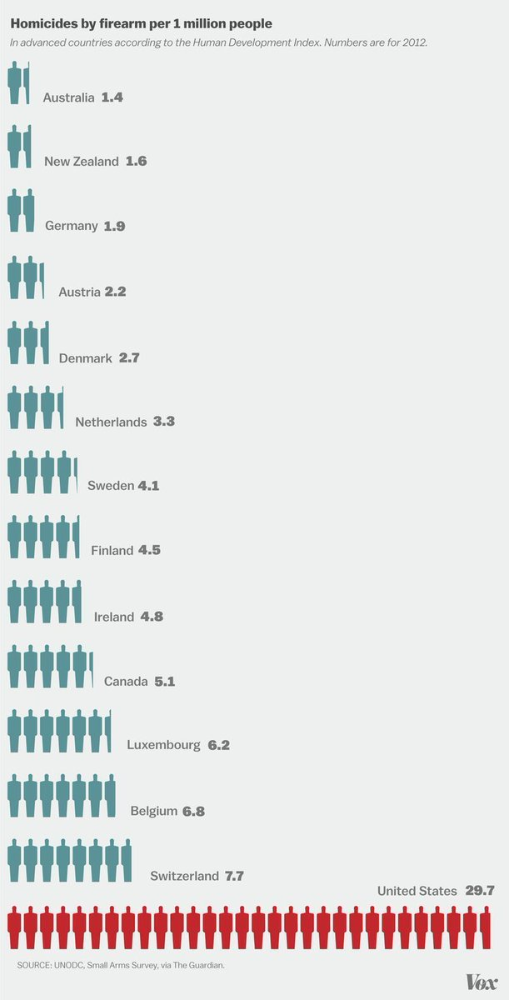
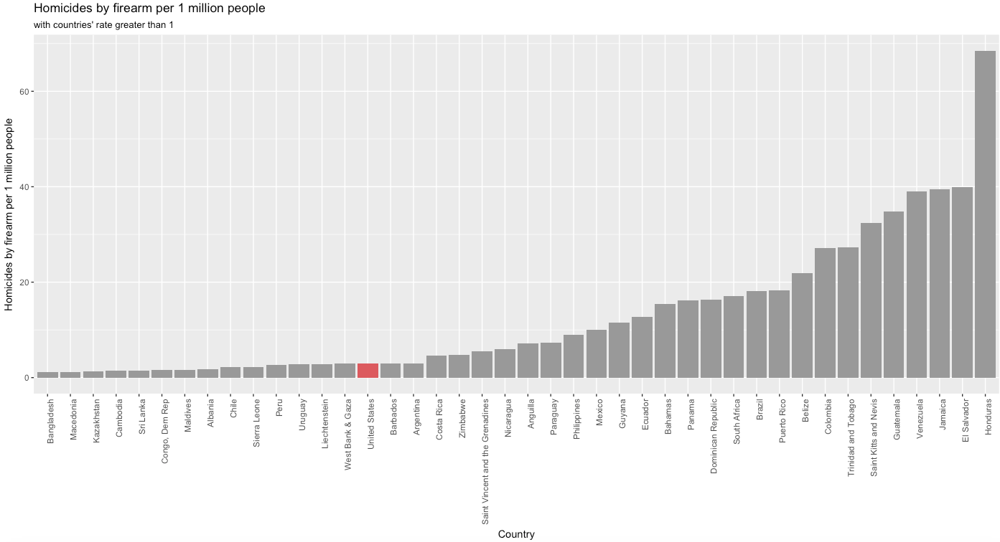
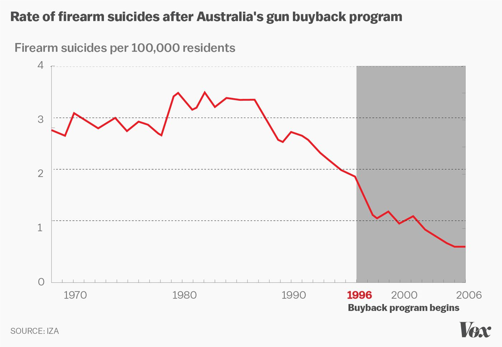
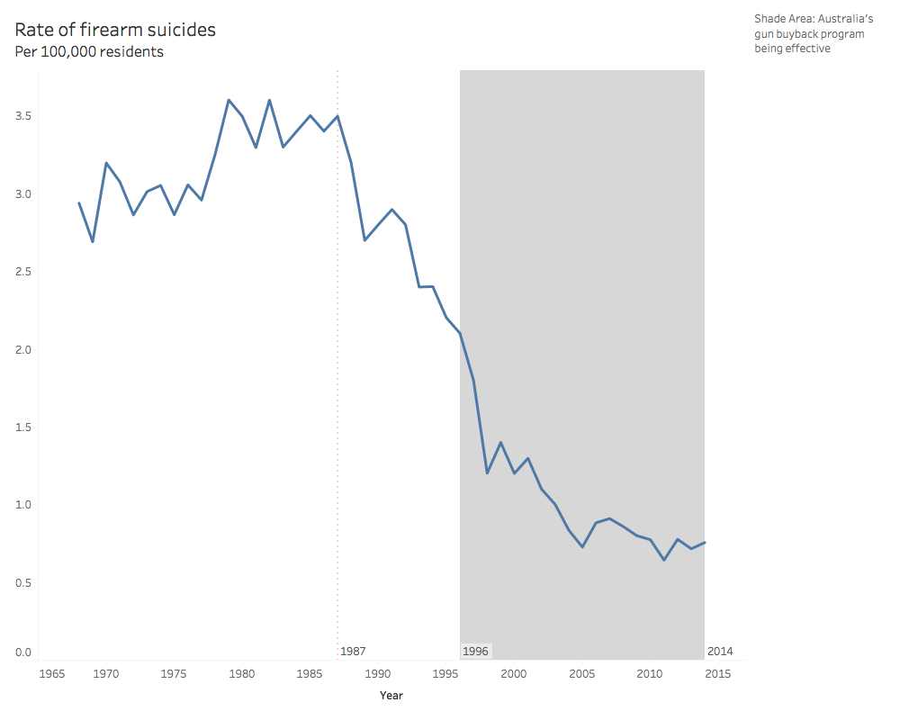
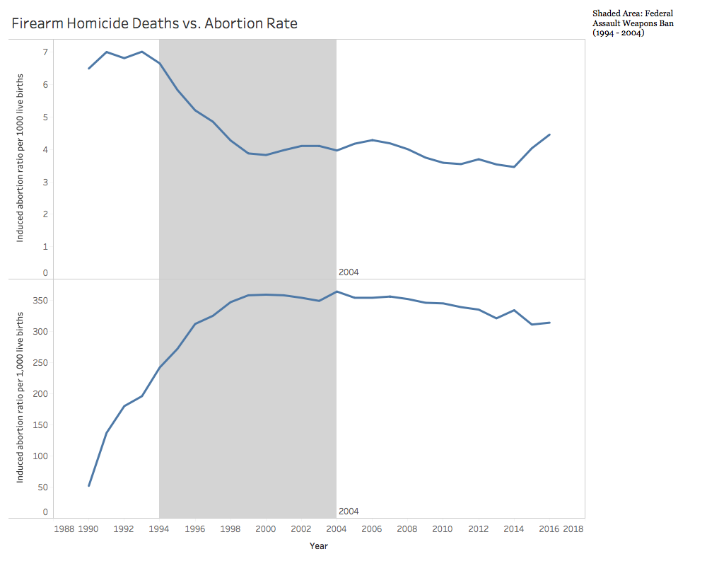

## First Version "Deception"
## Tianmin Li

## Introduction
Gun issue has been a controversial issue in US for a long time. Vox created a data product that illustrate the severe status quo of gun issue in US with 17 maps and charts. However, many of the charts are not showing the whole picture and the corresponding conclusions are misleading. This project is trying to create a deceptive data product that will use same or similar data but draw different conclusions from the Vox’s data product. 

## Finding 1: America doesn't have a severe firearm homicide problem compared to other countries such as Brazil.
### Vox's Version


Source: Vox, America's unique gun violence problem, explained in 17 maps and charts
### Deceptive Version

### Data Source
UNODC & Small arms survey, Retrieved from https://www.theguardian.com/news/datablog/2012/jul/22/gun-homicides-ownership-world-list#data. 
### Data Wrangling Steps
```{r}
# Read File
world_firearm <- read.csv("World_firearms_murders_and_ownership.csv")
# Select countries with Homicide by Firearm Rate per 100,000 Population greater than 1
selected_firearm <- subset(world_firearm, Homicide.by.firearm.rate.per.100.000.pop >1)
# Draw Bar Chart
library(ggplot2)
firearm <- ggplot(selected_firearm, aes(x=reorder(Country.Territory, Homicide.by.firearm.rate.per.100.000.pop), y=Homicide.by.firearm.rate.per.100.000.pop, fill=reorder(Country.Territory, Homicide.by.firearm.rate.per.100.000.pop)))
firearm + geom_bar(stat = "identity") + scale_fill_manual(values=c("#999999","#999999","#999999","#999999","#999999","#999999","#999999","#999999","#999999","#999999","#999999","#999999","#999999","#999999","#CC6666","#999999","#999999","#999999","#999999","#999999","#999999","#999999","#999999","#999999","#999999","#999999","#999999","#999999","#999999","#999999","#999999","#999999","#999999","#999999","#999999","#999999","#999999","#999999","#999999","#999999","#999999","#999999"), guide=FALSE) +theme(axis.text.x = element_text(angle = 90, hjust = 1)) + labs(x = "Country", y = "Homicides by firearm per 1 million people", title = "Homicides by firearm per 1 million people", subtitle = "with countries' rate greater than 1")
```
### Summary
The Vox's graph is cherry picking countries so as to make the point that US is having a severe firearm homicide issue. Using the same dataset with more countries, it is noticed that US is actually on the lower end of firearm homicide rate. Note that we are only showing countries whose homicide by firearm rate are greater than 1. The biggest reason is to increase chart's readability. Further, the condition will not affect the conclusion as US is having the rate around 2, where the conclusion is trying to prove that US does not have a severe firearm homicide rate compared to other countries. 

## Finding 2: Rate of firearm suicides decrease, even before Australia's gun buyback program
### Vox's Version

Source: Vox, America's unique gun violence problem, explained in 17 maps and charts
### Deceptive Version

(Interactive Graph: https://public.tableau.com/profile/tianmin.li#!/vizhome/australia_3/Dashboard1)
### Data Source
Australian Bureau of Statistics. Causes of Death. Retrieved from http://www.abs.gov.au/ausstats/abs@.nsf/ViewContent?readform&view=productsbytopic&Action=Expand&Num=5.7.14. 
### Data Wrangling Steps
```{r}
#read Data
australia <- read.csv("Australia-Homicides-Suicides.csv")
#rename and clean variables
colnames(australia)[1] <- "Year"
colnames(australia)[2] <- "firearm_suicide"
colnames(australia)[5] <- "non_firearm_suicide"
australia <- australia[, c("Year", "firearm_suicide", "non_firearm_suicide")]
#include years greater than 1967
australia <- subset(australia, Year > 1967)
#export data for Tableau visualization
write.csv(australia, file = "australia.csv")
```
### Summary
Vox's chart is claiming that the decrease of Australia's firearm suicides is because of the gun buyback program. While the research that the article is referencing does show that the program is having a significant impact on decreasing firearm suicide, the conclusion is not reflected on the graph. The deceptive data product is adding a reference line to the original graph, and that shows that starting from 1987, Australia has been experiencing a drastic decline in firearm suicide, almost ten years before the program started. 
## Finding 3: Gun homicides have declined over the past couple decades, however, it could have little relationship with gun control policy but much related to abortion legalization.
### Vox's Version


Source: Vox, America's unique gun violence problem, explained in 17 maps and charts
### Deceptive Version

(Interactive Graph: https://public.tableau.com/profile/tianmin.li#!/vizhome/FirearmHomicideDeathsvs_AbortionRate/Dashboard1) 
### Data Source
1. Centers for Disease Control and Prevention. Fatal Injury Reports, National, Regional and State, 1981 – 2016. Retrieved from https://webappa.cdc.gov/sasweb/ncipc/mortrate.html. 
2. Centers for Disease Control and Prevention. Abortion Surveillance Reports. Retrieved from https://www.cdc.gov/mmwr/preview/mmwrhtml/ss5713a1.htm. 
### Data Wrangling Steps
```{r}
# Read and Merge Data
firearm_81 <- read.csv("firearm1981_1998.csv")
firearm_99 <- read.csv("firearm1999_2016.csv")
firearm <- rbind(firearm_81, firearm_99)
firearm <- firearm[, c("Year", "Crude.Rate")]
abortion <- read.csv("abortion.csv")
#adjust year in abortion data to show the effect of abortion by adding 20 years
abortion["Year"] <- abortion["Year"] +20
#merge firearm data with abortion data
firearm_abortion <- merge(firearm, abortion, by = "Year")
#export csv file for Tableau visualization
write.csv(firearm_abortion, file = "firearm_abortion.csv")
```
### Summary
The original graph is showing the decreasing rate of firearm homicide deaths, with a guess that some policies might impact the decrease or the deterrence of gun. The deceptive version is comparing the firearm homicide deaths to corresponding abortion rate. This is based on Levitt’s (2005) theory that the drop of crime rate is the result of legalized abortion case Roe vs. Wade in 1973. It is argued that abortion helped teenager mothers, who are very likely to give birth to criminals because of their unstable economic and social situation, to stop pregnancy, and thus less criminals are produced. In the deceptive data product, the abortion year has been adjusted by adding 20 years to show when “criminals” are grown-ups. It is clear that as the abortion rate goes up, the firearm suicide rate is going down and it is very consistent over time. To make the argument more compelling, the period of Federal Assault Weapons Ban is also shaded in the chart, which shows that the policy doesn’t really help explain the decrease and increase of firearm suicide. 
## Roadmap
1. Change colors of the graphs to make them more appealing to audience.
2. Add more documentation to the charts to make it more self-explanatory.
3. Add data labels if necessary.
## Reference
1. Levitt, S. D., & Dubner, S. J. (2005). Freakonomics: A rogue economist explores the hidden side of everything. New York: William Morrow.
2. Lopez G. (2017). America's unique gun violence problem, explained in 17 maps and charts. Retrieved from https://www.vox.com/policy-and-politics/2017/10/2/16399418/us-gun-violence-statistics-maps-charts. 

