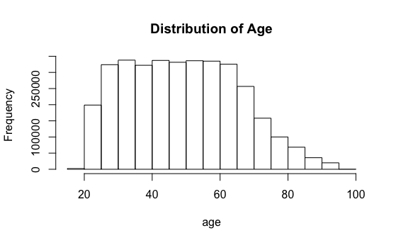

# Exploratory Data Analysis -- Higher Education
## Feng Wang, Jieyi Deng, Tianmin Li, Yingjie Yu, Zhonghe Han

## 1. Introduction 
This project is looking at college education related data to see how college education changes over time,across states and races. Specifically, we are looking at the following research questions:
1. What are the most popular college majors over years and across states?
2. What are the most popular college majors across gender and race over years?
3. What are the most lucrative majors over years?
4. What are the relationship between college majors and occupations?
5. How does college admission vary across states/universities?

Data used for the projects come from US Census Bureau and National Center for Education Statistics. This document is the exploratory data analysis that helps understand the datasets being used. 

## 2. Data Collection, Cleaning and Integration
## 2.1 Primary Dataset: ACS PUMS 2012-2016
### 2.1.1 Data Collection
Our dataset comes from United States Census. This dataset is about American Community Survey PUMS Data from 2012-2016, covers data from housing record to person record. Specificlly, from this dataset we know more about jobs and occupations, educational attainment, veterans, whether people own or rent their homes, and other topics. We choose related variables from that to help us know more insight of education. 

### 2.1.2 Data Used and Explanation
All variables we chose from our dataset are based on our exploration/research questions. First we want to see most popular majors over year and across states. So we picked up 'ST' which means different states, 'SERIALNO' gives identical number for each interviewee and include survey time. 'Fod1p' stand for specific majors. Also 'AGEP' means the exact age when people did that survey. With this four variables we can get data of people's college enrollment year, their majors and location. 
Second we want to know most popular college majors across gender and race over years, for this question we need variables of people's majors, gender and race. Therefore we chose variables of 'SEX' which stand for male and female, as well as 'RAC1P' show race of people. 
Then we care the most lucrative majors over years, here we need information of people's income and their major when graduated. We already had major data, so we included 'pincp' which means people's total income(any income sources). 
Last we are interested in realtionships between college and occupations, here we need people's major and which industry field they entered after graduated. To consider it throughly, we included both 'INDP' and 'NAICSP' mean different classify method, first one is industry recode and later one is code of North American Industry Classification System. 
Except variables mentioned above, we also included variable like 'ADJINC', means adjustment factor for income and earnings dollar amounts which helps us capture income more precisely,taking inflation into consideration; 'SCH','SCHG' and 'SCHL' help us segment people by with or without college experience, also college catagory; 'CITWP' which means if people were naturalized and when, we would like to see relation between immigration and major choice also its effect to state enrollment; 'COW' which stands by worker catgory, we think different major may lead to different work class. 

Here is a table of variable description.


### 2.1.3 Data Cleaning and Integration
Read and Combine Raw Data
```{r}
library(data.table)
census1 = fread('ss16pusa.csv')
census1 = census1[,c("ST","ADJINC","FOD1P","SCH","SCHG","SCHL","INDP","NAICSP","SEX","RAC1P","PINCP","AGEP","CITWP","COW","SERIALNO")]
census2 = fread('ss16pusb.csv')
census2 = census2[,c("ST","ADJINC","FOD1P","SCH","SCHG","SCHL","INDP","NAICSP","SEX","RAC1P","PINCP","AGEP","CITWP","COW","SERIALNO")]
census3 = fread('ss16pusc.csv')
census3 = census3[,c("ST","ADJINC","FOD1P","SCH","SCHG","SCHL","INDP","NAICSP","SEX","RAC1P","PINCP","AGEP","CITWP","COW","SERIALNO")]
census4 = fread('ss16pusd.csv')
census4 = census4[,c("ST","ADJINC","FOD1P","SCH","SCHG","SCHL","INDP","NAICSP","SEX","RAC1P","PINCP","AGEP","CITWP","COW","SERIALNO")]
census = rbind(census1, census2, census3, census4)
```
The research questions we looked at for the project are related to college education. As a result, we are removing the records that have missing values for the field of degree(FOD1P). 
```{r}
census = census[!is.na(census$FOD1P),]
```
In order to understand how popular majors change over years, it is essential to know when did a person attend college. This information is not provided in the data set. To get around with the problem, we make an assumption that people attend college at 18. By substrating the age of the respondent from the year the person took the survey and then add by 18, we will be able to get the year of the person attending college based on the assumption. The year of the survey is not explicitly provided in the data but we are able to get this information by taking the first four digits of the GQ person serial number (SERIALNO). 
```{r}
census$survey_year <-substr(census$SERIALNO,1,4)
census$survey_year <- as.numeric(census$survey_year)
census$college_year<-census$survey_year - census$AGEP + 18
census = census[,c("ST","ADJINC","FOD1P","SCH","SCHG","SCHL","INDP","NAICSP","SEX","RAC1P","PINCP","AGEP","CITWP","COW","survey_year", "college_year")]
```
Get State Name by Merging State FIP code
```{r}
state <- read.csv("us-state-ansi-fips.csv")
colnames(state)[2] <- "ST"
census <- merge(x = census, y = state, by = "ST", all.x = TRUE)
```
Income Inflation Adjusts
Since the dataset covers surveys from 2012 - 2016, it is necessary to adjust income so as to make them comparable. Using the adjusted factor for income and earnings(ADJINC), we are able to get the total peronal income to 2016 dollars. 
```{r}
census$income_2016 <- census$ADJINC*0.000001*census$PINCP
census = census[,c("ST","FOD1P","SCH","SCHG","SCHL","INDP","NAICSP","SEX","RAC1P","AGEP","COW","survey_year", "college_year", "stname", "stusps", "income_2016")]
```
## 2.2 Secondary Dataset: 2016 College Admission Dataset
### 2.2.1 Data Collection
To understand some of the general pattern of higher education in each state, the 2016 admission dataset from the National Center for Education Statistics will also be used.

### 2.2.2 Data Used and Explanation
Here we use the 2016 admission dataset to see which states are the most popular choices for applicants as well as in general, which states have the lowest admission rate. We also examine the dataset to get the states that have the highest and lowest enrollment rates. 
Variables being used in this dataset include total number of applicants, admission and enrollment for each university. These data will help us understand how popular/competitive it is to get into certain universities and thus are included in the analysis.
```{r}
library(data.table)
admin = fread('adm2016.csv')
code = fread('ipeds.csv')
sum(is.na(admin$APPLCN) == T)
sum(is.na(admin$ADMSSN) == T)
sum(is.na(admin$ENRLT) == T)
adm = admin[,c("UNITID","APPLCN","ADMSSN","ENRLT")]
adm_location = merge(adm, code, by.x = "UNITID", by.y = "V1")
adm_location = na.omit(adm_location)
```
Here is a table of variable description.


### 2.2.3 Data Cleaning and Integration
To see the pattern of applications, admissions and enrollments in each state, we aggregate the individual university data into a state-level one. And we also create two variables representing the admission rate and enrollment rate for each state. 
```{r}
adm_state = aggregate(adm_location[,c("APPLCN", "ADMSSN", "ENRLT")], by=list(adm_location$V4), FUN=sum, na.rm=TRUE)
names(adm_state)[1]<-"STATE"
adm_state$ADMRATE = adm_state$ADMSSN / adm_state$APPLCN
adm_state$ENRRATE = adm_state$ENRLT / adm_state$ADMSSN
```
## 3. Understanding Data
## 3.1 ACS PUMS 2012-2016
### Summarize Data
```{r}
dim(census)
```


For this dataset, we have 3489070 rows of data with 16 potential variables to be used.
```{r}
summary(census)
```


The descriptive data showed in the summary table looks normal for most variables. SCHG variable has an extremely high rate of missing value, which might affect our ability to identify whether this person has a bachelor's degree or a master or above. Alternatively, we can use the variable in SCHL to help make a conclusion. Variable INDP and COW also have certain amount of missing values. These two variables are related to job and industry and could potentially affect the result of our research question on the relationship between college education and job.

Variable State
```{r}
library(ggplot2)
ggplot(census, aes(x=stusps)) + geom_bar(aes(y = ..count..))+ labs(x='state', y = 'count')
```


The distribution of responders count by state looks good. The variance among states is because of the nature of the ACS data, which is propotional to the state population. 

Variable Sex
```{r}
ggplot(census, aes(x=SEX)) + geom_bar(aes(y = ..count..))+ labs(x='gender', y = 'count')+ scale_x_discrete(limits=c(1, 2), labels=c("male", "female"))
```


Female and Male are distributed evenly. 

Variable Race
```{r}
ggplot(census, aes(x=RAC1P)) + geom_bar(aes(y = (..count..)/sum(..count..)))+ labs(x='race', y = 'count')+ scale_x_discrete(limits=c(1,2,3,4,5,6,7,8,9), labels=c("White", "Black","American Indian", "Alaska Native", "American Indian and Alaska Native", "Asian", "Pacific Islander", "Some Other Race", "Two or More Races"))
```


The graph is giving us a general picture that some races are having very small data. To better understand how small it is, we table the frequency by race. 
```{r}
library(dplyr)
census %>%
  group_by(RAC1P) %>%
  summarise (n = n()) %>%
  mutate(freq = n / sum(n))
```


We see that white respondent are dominent, and that other races are having much lower data than it's proportion in US, especially for Alaska Native, American Indian and Alaska Native and Pacific Islander This could create a problem when we do anaylysis by race. Potentially we can combine some of groups together. 

Variable Ajusted Income
```{r}
hist(census$income_2016, breaks = 80, xlab="adjusted income", main="Distribution of Income")
```


Variable Age
```{r}
hist(census$AGEP, xlab="age", main="Distribution of Age")
```



The age distribution looks normal with the majority of responders' age betwen 25 to 65. This is beneficial because the majority age range are people who already graduated from college and this helps to analyze the relationship between college education and occupation, as well as college education and income.

Variable College Attending Year
```{r}
hist(census$college_year, xlab="college year", main="Distribution of College Year")
```


The college attendending distribution looks good. The graph is showing that as year goes by, there are more people attending college. There is a drop from 2010 but that is consistent with age distribution where younger people is taking up a small portion of data.

Variable State and Average Income
```{r}
ggplot(census, aes(x=stusps, y=income_2016)) + stat_summary(fun.y="mean", geom="bar") + labs(x='state', y = 'average income')

```


Variable Age and Average Income
```{r}
ggplot(census, aes(x=AGEP, y=income_2016)) + stat_summary(fun.y="mean", geom="bar") + labs(x='age', y = 'average income')
```


Variable Sex and Average Income
```{r}
ggplot(census, aes(x=SEX, y=income_2016)) + stat_summary(fun.y="mean", geom="bar") + scale_x_discrete(limits=c(1, 2), labels=c("male", "female")) + labs(x='gender', y = 'average income')
```


Variable Race and Average Income
```{r}
ggplot(census, aes(x=RAC1P, y=income_2016)) + stat_summary(fun.y="mean", geom="bar") + scale_x_discrete(limits=c(1, 2,3,4,5,6,7,8,9), labels=c("White", "Black","American Indian", "Alaska Native", "American Indian and Alaska Native", "Asian", "Pacific Islander", "Some Other Race", "Two or More Races")) + labs(x='Race', y = 'average income')
```


The above graphs are showing the relationships of state, age, sex and race with income. There aren't much outstanding issues that we need to pay special attention to. One thing we need to know is that when comparing college education to income, age, sex, state and race might be important to the income other than education alone. 

## 3.2 2016 College Admission Dataset
Below is a summary statistics of the admission dataset. 
```{r}
summary(adm_state)
```


```{r}
list(max(adm_state[,"APPLCN"]), adm_state[which.max(adm_state[,"APPLCN"]), "STATE"])
list(min(adm_state[,"APPLCN"]), adm_state[which.min(adm_state[,"APPLCN"]), "STATE"])
list(max(adm_state[,"ADMSSN"]), adm_state[which.max(adm_state[,"ADMSSN"]), "STATE"])
list(min(adm_state[,"ADMSSN"]), adm_state[which.min(adm_state[,"ADMSSN"]), "STATE"])
list(max(adm_state[,"ENRLT"]), adm_state[which.max(adm_state[,"ENRLT"]), "STATE"])
list(min(adm_state[,"ENRLT"]), adm_state[which.min(adm_state[,"ENRLT"]), "STATE"])
list(max(adm_state[,"ADMRATE"]), adm_state[which.max(adm_state[,"ADMRATE"]), "STATE"])
list(min(adm_state[,"ADMRATE"]), adm_state[which.min(adm_state[,"ADMRATE"]), "STATE"])
list(max(adm_state[,"ENRRATE"]), adm_state[which.max(adm_state[,"ENRRATE"]), "STATE"])
list(min(adm_state[,"ENRRATE"]), adm_state[which.min(adm_state[,"ENRRATE"]), "STATE"])
```
California has the largest number of applications, admissions and enrollments in 2016 while Micronesia, a frelly associated state of the U.S., has the lowest number of applications and admissions, with Virgin Island being the one that has the smallest number of enrollments. As for the admission rate, Wyoming has the highest admission rate of around 95%, while D.C. has the lowest. The unincorporated organized territory Puerto Rico has the highest rate of enrollment (78%) while New Hampshire has the lowest rate of only 19%.

## 4. Limitations
1. The dataset don't have year that people attend college and thus we calculated based on an assuption that everyone is attending college at 18 years old. However, it is very likely that people attend college later than 18 years old and that will affect the accuracy of results.
2. The college major variable only exists from ACS PUMS 2012-2016 data and this limited our sample for the analysis. 
3. The census data have the problem of sampling errors because it is only a selective portion of the whole population. 
4. For the admission data, we only look at the dataset for one year now. To figure the trend of the application, admission and enrollment over years, we need to merge dataset from previous years as well. 

## 5. Reference
1. Wikipedia. List of U.S. states and territories by population. Retrieved from https://en.wikipedia.org/wiki/List_of_U.S._states_and_territories_by_population. 
2. Wikipedia. Race and ethnicity in the United States. https://en.wikipedia.org/wiki/Race_and_ethnicity_in_the_United_States
3. Brooks, T., Khatiwada S., Vargas J. & McCurry M. (2017).The U.S. Census Bureau and American Community Survey:Advantages, Uses, and Limitations. Retrieved from https://www.sdstate.edu/sites/default/files/2017-01/RS3-08.pdf. 

## 6. Data Retrieved
1. ACS PUMS data 2012 - 2016. Retrieved from https://www2.census.gov/programs-surveys/acs/data/pums/2016/5-Year/.
2. Admission and Test Scores data. Retrieved from https://nces.ed.gov/ipeds/datacenter/DataFiles.aspx.
