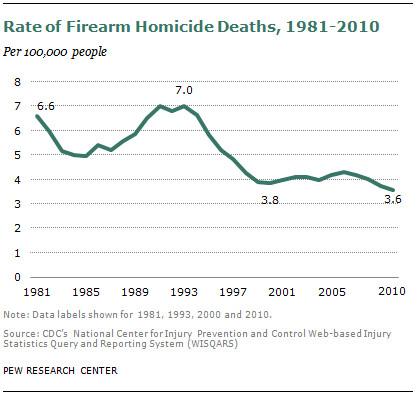
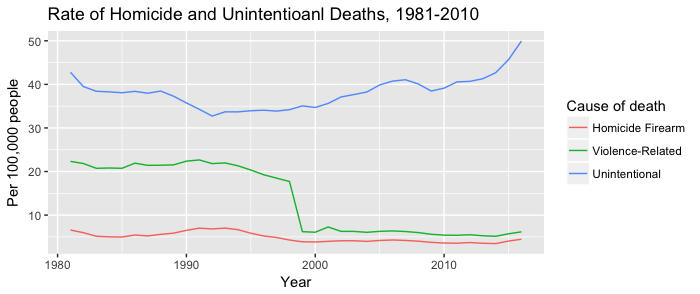
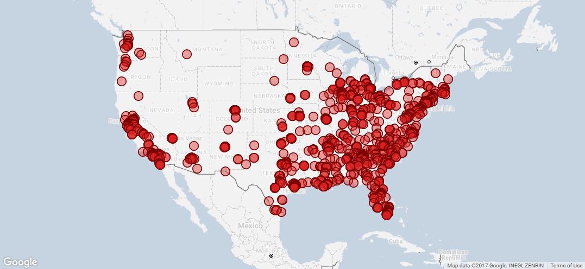
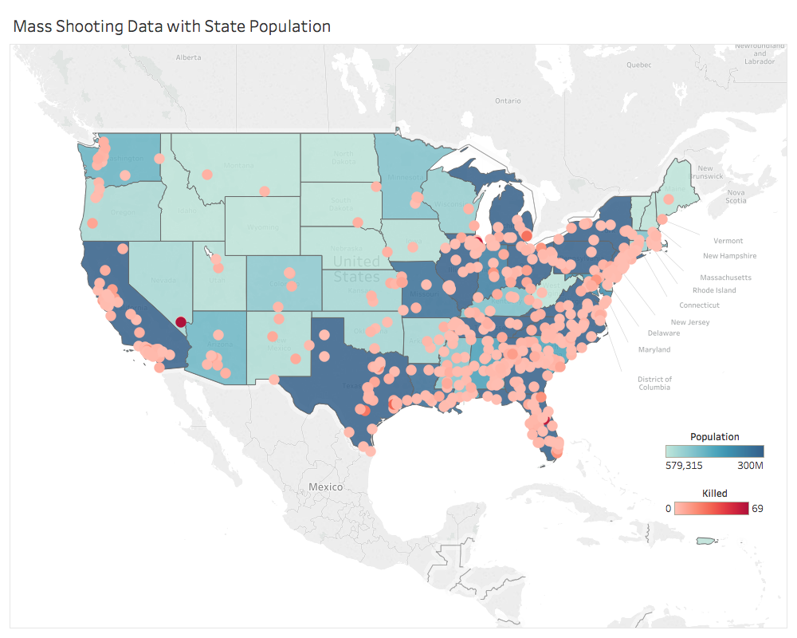
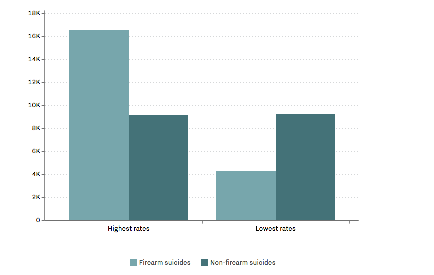
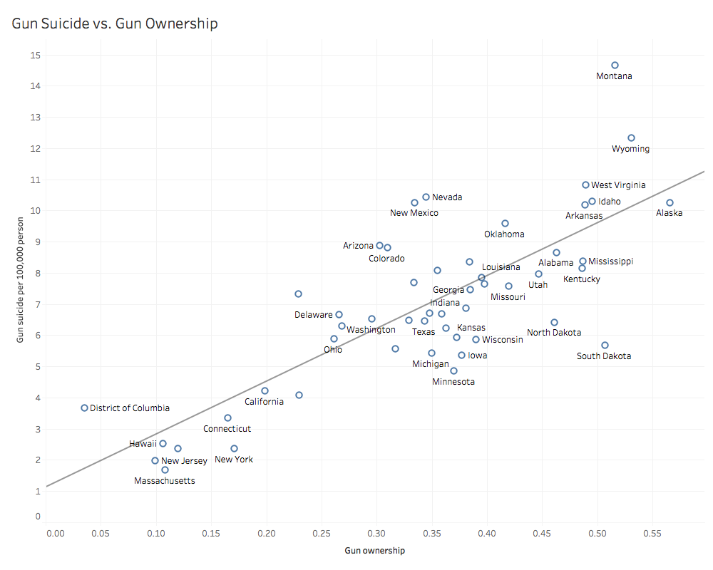

## First Version "Redesign"
## Tianmin Li
## Finding 1: Revision of "Rate of Firearm Homicide Deaths, 1981-2010"
The original graph demonstrates the rate of firearm deaths from 1981 to 2010. 



The following graph is a revision that shows the breakdown of homicide firearm, violence-related (homicide and suicide) and unintentional death rate from 1981 to 2010. 



### Development Process
Data source: Centers for Disease Control and Prevention

Fatal Injury Reports, 1981 to 1998 (ICD-9), National, Regional and State

Fatal Injury Reports, 1999 to 2016 (ICD-10), National and Regional 

Retrieved from https://webappa.cdc.gov/sasweb/ncipc/mortrate.html

Data cleaning: R

Data visualization: R (ggplot)

### Data Wrangling Steps
Read Data
```{r}
firearm_81_98 <- read.csv('firearm1981_1998.csv', header = TRUE) 
firearm_99_16 <- read.csv('firearm1999_2016.csv', header = TRUE)
homicide_81_98 <- read.csv('homicide1981_1998.csv', header = TRUE) 
homicide_99_16 <- read.csv('homicide1999_2016.csv', header = TRUE)
unintentional_81_98 <- read.csv('unintentional1981_1998.csv', header = TRUE) 
unintentional_99_16 <- read.csv('unintentional1999_2016.csv', header = TRUE)
```
Clean and Merge Two Datasets
```{r}
firearm <- rbind(firearm_81_98, firearm_99_16)
firearm <- firearm[,c("Year", "Cause.of.Death", "Crude.Rate")]
homicide <- rbind(homicide_81_98, homicide_99_16)
homicide <- homicide[,c("Year", "Cause.of.Death", "Crude.Rate")]
unintentional <- rbind(unintentional_81_98, unintentional_99_16)
unintentional <- unintentional[,c("Year", "Cause.of.Death", "Crude.Rate")]
fatal_rate <- rbind(firearm, homicide, unintentional)
fatal_rate <- fatal_rate[!is.na(fatal_rate$Year),]
fatal_rate$Cause.of.Death[fatal_rate$Cause.of.Death == "Homicide/Legal Intervention Injury"] <- "Violence-Related"
fatal_rate$Cause.of.Death[fatal_rate$Cause.of.Death == "Unintentional Injury"] <- "Unintentional"
fatal_rate <- subset(fatal_rate, Year < 2011)
```
Plot Data Using ggplot
```{r}
library(ggplot2)
ggplot(data=fatal_rate, aes(x=Year, y=Crude.Rate, group = Cause.of.Death, colour = as.factor(Cause.of.Death))) + geom_line() + labs(title = 'Rate of Homicide and Unintentional Deaths, 1981-2010', y = 'Per 100,000 people', colour= 'Cause of death')
```
### Reasoning
The original graph is misleading with the stand-alone line of firearm homicide deaths. It was hard to draw conclusions about reasons behind the rate without comparing it to other death rates. In the revised version, the rate of firearm homicide deaths is compared with violent-related deaths (including all homicide and suicide) and unintentional deaths. From the revised graph we can tell that it is not just the firearm deaths that's dropping but also the overall voilent-related deaths over years. This point is confirmed by Ehrenfreund (2015) that the drop in gun violence is part of the drop in overall voilent crime. 

### Detour
1. It was challenging pulling data in a way that is similar to the original graph and easy for visualization.
2. It took a while to determining the categories of cause of death so as to draw a comprehensive picture of death rate changes over years.

## Finding 2: Revision of Mass Shooting Map
The original graph shows the mass shooting since 2013. 



The following graph is a revision that shows mass shooting happening after 2013, together with states population.
(Interactive Graph: https://public.tableau.com/profile/tianmin.li#!/vizhome/MassShootingData_0/massshooting) 



### Development Process
Data source: Gun Violence Archive

Mass Shootings in 2014

Mass Shootings in 2015

Mass Shootings in 2016

Mass Shootings in 2017

Mass Shootings in 2018

Retrieved from http://www.gunviolencearchive.org/reports

U.S. Census Bureau

Annual Estimates fo the Resident Population for the United States, Regions, States, and Puerto Rico: April 1, 2010 to July 1, 2017 

Retrieved from https://www.census.gov/data/tables/2017/demo/popest/state-total.html

Data cleaning: R

Data visualization: Tableau

### Data Wrangling Steps
Read Data
```{r}
shoot_2014 <- read.csv("shoot_2014.csv", header = TRUE)
shoot_2015 <- read.csv("shoot_2015.csv", header = TRUE)
shoot_2016 <- read.csv("shoot_2016.csv", header = TRUE)
shoot_2017 <- read.csv("shoot_2017.csv", header = TRUE)
shoot_2018 <- read.csv("shoot_2018.csv", header = TRUE)
mass_shoot <- rbind(shoot_2014, shoot_2015, shoot_2016, shoot_2017, shoot_2018)
population <- read.csv("nst-est2017-alldata.csv")
population <- population[, c("NAME", "POPESTIMATE2017")]
colnames(population)[1] <- "State"
```
Merge mass shooting data with state population data
```{r}
mass_shoot <- merge(x = mass_shoot, y = population, by = "State", all = TRUE)
mass_shoot$Country <- "United States"
mass_shoot <- mass_shoot [(!(mass_shoot$State=="Alaska") & !(mass_shoot$State=="Hawaii") & !(mass_shoot$State=="United States")),]
```
Export data to csv for visualization in Tableau
```{r}
write.csv(mass_shoot, file = "mass_shoot.csv")
```
### Reasoning
The original graph is misleading because it is sending a message that in certain states such as California, it is more likely to have mass shooting. Looking at the places that have more mass shooting, it is actually very related to the population. In the revised graph, the population of the states and mass shooting are both displayed and there is a clear relationship between the two. 

### Detour
1. Reading the BRFSS 2001 data into R is challenging as it had the SAS Transport format. 
2. Combining two layers in one map in Tableau was challenging. Problem solved using dual axis maps. 

## Finding 3: Revision of "States with the Most Guns Report the Most Suicides"
The original graph shows the suicides in states with the highest and lowest rates of gun ownership.



The revised graph shows the relationship bewteen gun ownership and gun suicide deaths with all states data displayed.  
(Interactive Graph: https://public.tableau.com/profile/tianmin.li#!/vizhome/gun_suicide/Dashboard1)



### Development Process
Data source: Centers for Disease Control and Prevention

2001 BRFSS Data

Retrieved from https://www.cdc.gov/brfss/annual_data/annual_2001.htm

Centers for Disease Control and Prevention

Fatal Injury Reports, 1999 to 2016 (ICD-9), National, Regional and State (Restricted)

Retrieved from https://webappa.cdc.gov/sasweb/ncipc/mortrate.html

Data cleaning: R

Data visualization: Tableau

### Data Wrangling Steps
Read and Clean Data
```{r}
suicide <- read.csv("firearm.csv")
suicide <- suicide[,c("State", "Crude.Rate")]
library(Hmisc)
gun_ownership <- sasxport.get("CDBRFS01.XPT")
gun <- gun_ownership[,c("x.state", "firearm3")]
colnames(gun) <- c("st", "Firearm")
state_code <- read.csv("us-state-ansi-fips.csv")
gun <- merge(x = gun, y = state_code, by = "st", all.x = TRUE)
names(gun)[3] <- "State"
gun <- subset(gun, st!= 66 & st!= 72 & st!= 78)
```
According to the 2001 BRFSS Codebook, 1 represents firarm kept in or around home. This step will calculate the gun ownership rate per state. 
```{r}
library(dplyr)
gun_summary <- gun %>%
  group_by(State, stusps) %>%
  summarize( ownership = sum(Firearm ==1) / n())
```
Merge gun ownership with suicide data
```{r}
gun_combined <- merge(x = gun_summary, y = suicide, by = "State", all= TRUE)
```
Export Data for Visualization in Tableau
```{r}
write.csv(gun_combined, file = "gun_combined.csv")
```
### Reasoning
The original plot is not straight forward in terms of readiness. It is really hard to understand what the bars are showing and how to compare the four bars. Further, showing the highest/lowest gun ownership states are not convincing as these states can just be outliers. To tackle these two problems, all states' gun ownership vs. gun suicide rate are displayed in the revised plot.  

### Detour
1. Had to read the codebook to figure out variables to be used and the meaning of the variables.
2. Merging data from different sources are diffcult as some dataset is using state abbreviation and some using full names. A data set that translate both information is used to help merge data. 

## Road-map with Future Features/Enhancements
1. The current version of Finidng 2 is still not straight-forward as audience needs to pay attention to 2 layers of the map. It will be better if I calculate the rate that both takes mass shooting and population into considereation.

2. The data source of Finidng 3 is coming from a survey and sample data needs to be weighted for better calculation. 

3. Graph color and size needs to be polished so as to look more attractive to audiences. 

## Reference
Ehrenfreund M. (2015). We've Had a Massive Decline in Gun Violence in the United States. Here's Why. Retrieved from https://www.washingtonpost.com/news/wonk/wp/2015/12/03/weve-had-a-massive-decline-in-gun-violence-in-the-united-states-heres-why/?utm_term=.189af8a0f2cd. 

