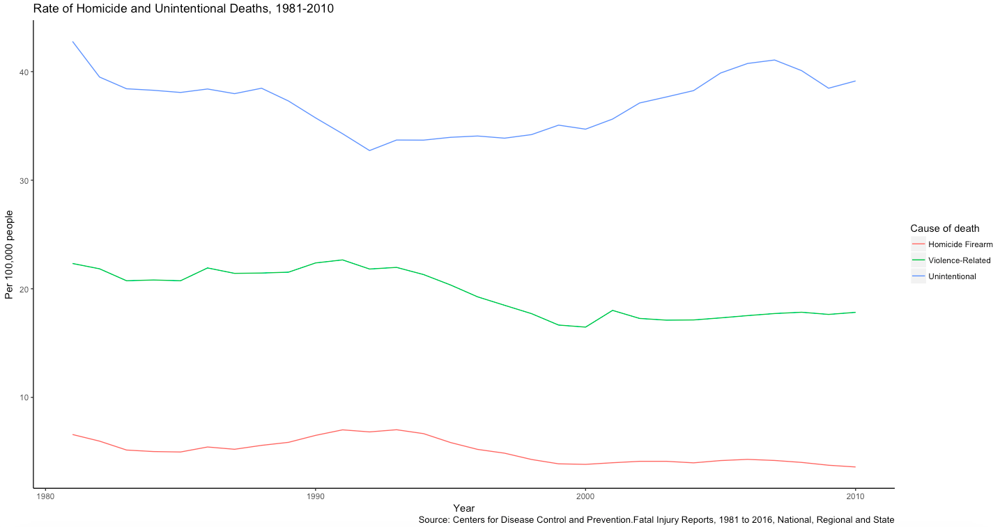
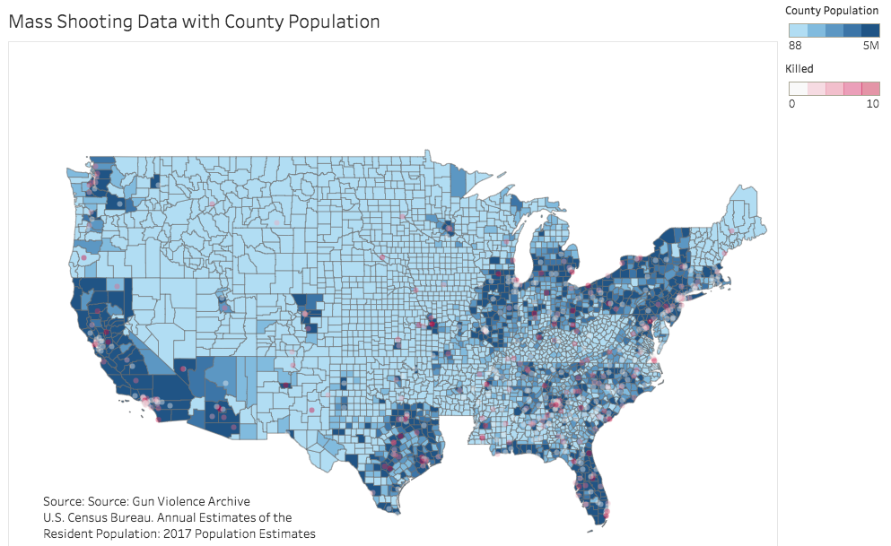
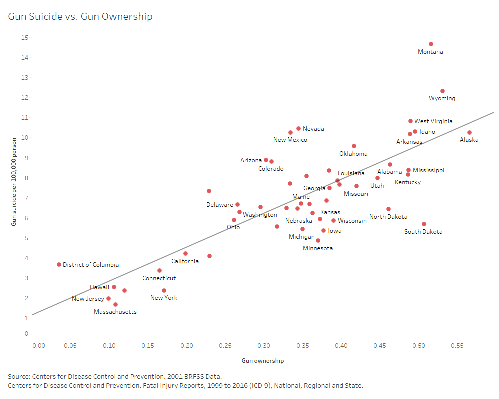
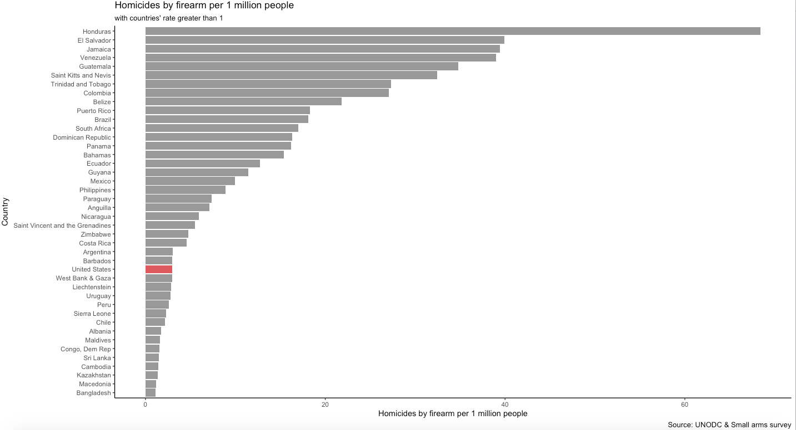
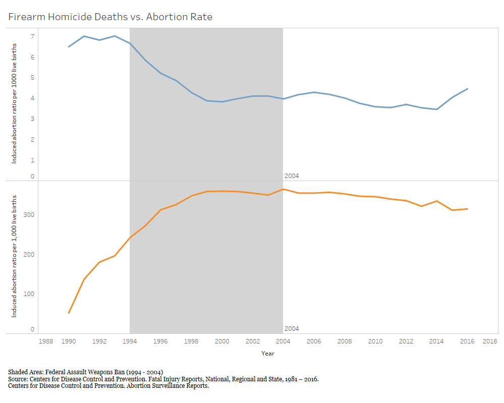

## Revised Data Product
## Tianmin Li
## Introduction
Gun problem has been a controversial issue in US for a long time. Vox created a data product that illustrated the severe status quo of gun issue in US with 17 maps and charts. However, many of the charts are either not well presented or not showing the whole picture and thus creating misleading conclusions. This project is trying to create and refine a redesign and deceptive data products that will use same or similar data but either refine or draw different conclusions from the Vox’s data product. This document is the second version that tries to make the data product looks more convincing. 
## Redesign Data Product
## Finding 1: Gun homicides (like all homicides) have declined over the past couple decades
### Vox Version


Source: Vox, America's unique gun violence problem, explained in 17 maps and charts
### First Revision


### Second Revision

### Reasoning
The original graph demonstrates the rate of firearm deaths from 1981 to 2010. However, the chart doesn't really support the claim by simply showing the rate of firearm deaths. It was hard to draw conclusions about reasons behind the rate without comparing it to other death rates. Combining the argument model and analytic design, it is advised to show different causes of homicides in order to compare and contrast the differences among various types.

In the first revised version, the rate of firearm homicide deaths is compared with violent-related deaths (including all homicide and suicide) and unintentional deaths. From the graph we can tell that it is not just the firearm deaths that's dropping but also the overall violent-related deaths over years. This point is confirmed by Ehrenfreund (2015) that the drop in gun violence is part of the drop in overall voilent crime. 

There are some improvements made in the second revision. Noticing a steep drop around 1999 for violence-related homicides, data source was revisited and the change of the way that homicides deaths were calculated was found. A more comparable-to-previous data source was used instead to avoid additional concern from the audience. Further, the grids that was automatically created by ggplot were cleared to increase data-pixel ratio. The three colors being used to represent different causes of death aim to contrast different categories and thus are necessary. The typo in the first version was corrected and the data source was added to the graph so more information that are appealing to the audience are presented.

### Data Wrangling Steps
Read Data
```{r}
firearm_81_98 <- read.csv('firearm1981_1998.csv', header = TRUE) 
firearm_99_16 <- read.csv('firearm1999_2016.csv', header = TRUE)
homicide_81_98 <- read.csv('homicide1981_1998.csv', header = TRUE) 
homicide_99_16 <- read.csv('homicide1999_2016.csv', header = TRUE)
unintentional_81_98 <- read.csv('unintentional1981_1998.csv', header = TRUE) 
unintentional_99_16 <- read.csv('unintentional1999_2016.csv', header = TRUE)
```
Clean and Merge Two Datasets
```{r}
firearm <- rbind(firearm_81_98, firearm_99_16)
firearm <- firearm[,c("Year", "Cause.of.Death", "Crude.Rate")]
homicide <- rbind(homicide_81_98, homicide_99_16)
homicide <- homicide[,c("Year", "Cause.of.Death", "Crude.Rate")]
unintentional <- rbind(unintentional_81_98, unintentional_99_16)
unintentional <- unintentional[,c("Year", "Cause.of.Death", "Crude.Rate")]
fatal_rate <- rbind(firearm, homicide, unintentional)
fatal_rate <- fatal_rate[!is.na(fatal_rate$Year),]
fatal_rate$Cause.of.Death[fatal_rate$Cause.of.Death == "Violence-Related Injury"] <- "Violence-Related"
fatal_rate$Cause.of.Death[fatal_rate$Cause.of.Death == "Unintentional Injury"] <- "Unintentional"
fatal_rate <- subset(fatal_rate, Year < 2011)
```
Plot Data Using ggplot
```{r}
library(ggplot2)
ggplot(data=fatal_rate, aes(x=Year, y=Crude.Rate, group = Cause.of.Death, colour = as.factor(Cause.of.Death))) + geom_line() + theme(panel.grid.major = element_blank(), panel.grid.minor = element_blank(),
panel.background = element_blank(), axis.line = element_line(colour = "black")) + labs(title = 'Rate of Homicide and Unintentional Deaths, 1981-2010', y = 'Per 100,000 people', colour= 'Cause of death',caption = "Source: Centers for Disease Control and Prevention.Fatal Injury Reports, 1981 to 2016, National, Regional and State")
```
## Finding 2: There have been more than 1,600 mass shootings since Sandy Hook
### Vox Version


Source: Vox, America's unique gun violence problem, explained in 17 maps and charts
### First Revision
(Interactive Graph: https://public.tableau.com/profile/tianmin.li#!/vizhome/MassShootingData_0/massshooting) 


### Second Revision
(Interactive Graph: https://public.tableau.com/profile/tianmin.li#!/vizhome/mass_shooting_revised/Dashboard1) 



### Reasoning
The Vox version is using a controversial way of preseting mass shooting data in US by showing information in a map. It is debatable on whether it is necessary to present such information on a map. The approach is recognized in this project because using map to present every single mass shooting is sending a strong message to the audience on how bad the situation is. Further, the distribution on the map looks more convincing that simply showing aggregating data in bar charts with detailed information on when the incident happened and casualty. For this reason, the revisions continue with the map approach. 

While it is legit to use a map to convey the information, the Vox version is misleading because it is sending a message that in certain states such as California, mass shootings are more likely to happen. Looking at the places that have more mass shooting, it is actually very related to the population. Using the analytic design of contrasting, the population of the states and mass shooting are both displayed and there is a relationship between the two in the revised graph. 

One big problem with the first revision is that the dots are covering some underneath population information because of the size and opacity. To tackle the problem. size of the dots are decrease the the colors look more transparent so the underneath information can come through. In addition, county population information is used instead of state and thus the relationship between population and mass shooting is even more clear. Color blue and red are chosen to represent population and mass shooting because the two colors contrast with each other well. Red represeting mass shooting will convey a stronger message to the audience. The legends are being adjusted as well since 5 million for a county can be already regarded as a populous county and similarly, 20 killings in a mass shooting is a severe one. Further, countries other than US are taken out from the map to increase data pixel ratio. Sources are also added for audiences' reference. 

### Data Wrangling Steps
Read Data
```{r}
shoot_2014 <- read.csv("shoot_2014.csv", header = TRUE)
shoot_2015 <- read.csv("shoot_2015.csv", header = TRUE)
shoot_2016 <- read.csv("shoot_2016.csv", header = TRUE)
shoot_2017 <- read.csv("shoot_2017.csv", header = TRUE)
shoot_2018 <- read.csv("shoot_2018.csv", header = TRUE)
mass_shoot <- rbind(shoot_2014, shoot_2015, shoot_2016, shoot_2017, shoot_2018)
population <- read.csv("PEP_2017_PEPANNRES_with_ann.csv")
population <- population[, c("GEO.display.label", "respop72017")]
population <- population[-c(1), ]
library(tidyr)
population <- separate(population,GEO.display.label,into=c("County", "State" ),sep = ", ")
colnames(population)[3] <- "Population"
```
Export data to csv for visualization in Tableau
```{r}
write.csv(mass_shoot, file = "mass_shoot.csv")
write.csv(population, file = "population_2017.csv")
```
## Finding 3: The states with the most guns report the most suicides
### Vox Version


Source: Vox, America's unique gun violence problem, explained in 17 maps and charts
### First Revision
(Interactive Graph: https://public.tableau.com/profile/tianmin.li#!/vizhome/gun_suicide/Dashboard1)


### Second Revision
(Interactive Graph: https://public.tableau.com/profile/tianmin.li#!/vizhome/gun_suicide_revised/Dashboard2)


### Reasoning
The Vox plot is not straight forward in terms of readiness and is not convincing. On the one hand, it is really hard to understand what the bars are showing and how to compare the four bars. On the other hand, showing the highest/lowest gun ownership states are not convincing as these states can just be outliers or there might be a u-shape in the general trend so the conclusion is misleading. To tackle these two problems, all states' gun ownership vs. gun suicide rate are displayed in the revised plot to make the constrast clear (using analytic design). A trending line has been added to support the argument that more guns are associated with more suicides. In the revised version, colors of the dots have been changed to red because it draws more attention than the previous one. The grids were removed to increase data pixel ratio.

### Data Wrangling Steps
Read and Clean Data
```{r}
suicide <- read.csv("firearm.csv")
suicide <- suicide[,c("State", "Crude.Rate")]
library(Hmisc)
gun_ownership <- sasxport.get("CDBRFS01.XPT")
gun <- gun_ownership[,c("x.state", "firearm3")]
colnames(gun) <- c("st", "Firearm")
state_code <- read.csv("us-state-ansi-fips.csv")
gun <- merge(x = gun, y = state_code, by = "st", all.x = TRUE)
names(gun)[3] <- "State"
gun <- subset(gun, st!= 66 & st!= 72 & st!= 78)
```
According to the 2001 BRFSS Codebook, 1 represents firarm kept in or around home. This step will calculate the gun ownership rate per state. 
```{r}
library(dplyr)
gun_summary <- gun %>%
  group_by(State, stusps) %>%
  summarize( ownership = sum(Firearm ==1) / n())
```
Merge gun ownership with suicide data
```{r}
gun_combined <- merge(x = gun_summary, y = suicide, by = "State", all= TRUE)
```
Export Data for Visualization in Tableau
```{r}
write.csv(gun_combined, file = "gun_combined.csv")
```
## Deception Data Product 
## Finding 1: America doesn't have a severe firearm homicide problem compared to other countries such as Brazil.
### Vox's Version


Source: Vox, America's unique gun violence problem, explained in 17 maps and charts
### First Deceptive Version

### Second Deceptive Version

### Reasoning
The Vox's graph is cherry picking countries so as to make the point that US is having a severe firearm homicide issue. Using the same dataset and contrasting with more countries, it is noticed that US is actually on the lower end of firearm homicide rate. The argument model is being analyzed for this visual to draw an opposite conclusion. Note that we are only showing countries whose homicide by firearm rate are greater than 1. The biggest reason is to increase chart's readability. Further, the condition will not affect the conclusion as US is having the rate around 2, where the conclusion is trying to prove that US does not have a severe firearm homicide rate compared to other countries.Color red is being used for US because this is the country that we are interested in and it stood out in comparison and thus increased the data pixel ratio. In the revised version, x axis and y axis are switched because it is more readable for the audience. 

### Data Wrangling Steps
```{r}
# Read File
world_firearm <- read.csv("World_firearms_murders_and_ownership.csv")
# Select countries with Homicide by Firearm Rate per 100,000 Population greater than 1
selected_firearm <- subset(world_firearm, Homicide.by.firearm.rate.per.100.000.pop >1)
# Draw Bar Chart
library(ggplot2)
firearm <- ggplot(selected_firearm, aes(x=reorder(Country.Territory, Homicide.by.firearm.rate.per.100.000.pop), y=Homicide.by.firearm.rate.per.100.000.pop, fill=reorder(Country.Territory, Homicide.by.firearm.rate.per.100.000.pop)))
firearm + geom_bar(stat = "identity") + scale_fill_manual(values=c("#999999","#999999","#999999","#999999","#999999","#999999","#999999","#999999","#999999","#999999","#999999","#999999","#999999","#999999","#CC6666","#999999","#999999","#999999","#999999","#999999","#999999","#999999","#999999","#999999","#999999","#999999","#999999","#999999","#999999","#999999","#999999","#999999","#999999","#999999","#999999","#999999","#999999","#999999","#999999","#999999","#999999","#999999"), guide=FALSE) +theme(panel.grid.major = element_blank(), panel.grid.minor = element_blank(),panel.background = element_blank(), axis.line = element_line(colour = "black")) + labs(x = "Country", y = "Homicides by firearm per 1 million people", title = "Homicides by firearm per 1 million people", subtitle = "with countries' rate greater than 1", caption = "Source: UNODC & Small arms survey")+ coord_flip()
```
## Finding 2: Rate of firearm suicides decrease, even before Australia's gun buyback program
### Vox's Version

Source: Vox, America's unique gun violence problem, explained in 17 maps and charts
### Deceptive Version

(Interactive Graph: https://public.tableau.com/profile/tianmin.li#!/vizhome/australia_3/Dashboard1)
### Data Source
Australian Bureau of Statistics. Causes of Death. Retrieved from http://www.abs.gov.au/ausstats/abs@.nsf/ViewContent?readform&view=productsbytopic&Action=Expand&Num=5.7.14.
### Reasoning
Vox's chart is claiming that the decrease of Australia's firearm suicides is because of the gun buyback program. While the research that the article is referencing does show that the program is having a significant impact on decreasing firearm suicide, the conclusion is not reflected on the graph. The deceptive data product is adding a reference line to the original graph, and that shows that starting from 1987, Australia has been experiencing a drastic decline in firearm suicide, almost ten years before the program started. The red line being used in year 1987 is to draw audience attention to the drastic change since then and it is a good contrast to the blue line. Note that years prior to 1987 are presented as well so as to show a whole picture of how firearm suicide changes over time and avoid the doubt of cherry picking data. 
### Data Wrangling Steps
```{r}
#read Data
australia <- read.csv("Australia-Homicides-Suicides.csv")
#rename and clean variables
colnames(australia)[1] <- "Year"
colnames(australia)[2] <- "firearm_suicide"
colnames(australia)[5] <- "non_firearm_suicide"
australia <- australia[, c("Year", "firearm_suicide", "non_firearm_suicide")]
#include years greater than 1967
australia <- subset(australia, Year > 1967)
#export data for Tableau visualization
write.csv(australia, file = "australia.csv")
```
## Finding 3: Gun homicides have declined over the past couple decades, however, it could have little relationship with gun control policy but much related to abortion legalization.
### Vox's Version

Source: Vox, America's unique gun violence problem, explained in 17 maps and charts
### First Deceptive Version
(Interactive Graph: https://public.tableau.com/profile/tianmin.li#!/vizhome/FirearmHomicideDeathsvs_AbortionRate/Dashboard1) 


### Second Deceptive Version
(Interactive Graph: https://public.tableau.com/profile/tianmin.li#!/vizhome/FirearmHomicideDeathsvs_AbortionRate/Dashboard2)

### Reasoning
The original graph is showing the decreasing rate of firearm homicide deaths, with a guess that some policies might impact the decrease or the deterrence of gun. Such data product failed to picture reasons behind the stand-alone graph in lack of contrast. The deceptive version is comparing the firearm homicide deaths to corresponding abortion rate. This is based on Levitt’s (2005) theory that the drop of crime rate is the result of legalized abortion case Roe vs. Wade in 1973. It is argued that abortion helped teenager mothers, who are very likely to give birth to criminals because of their unstable economic and social situation, to stop pregnancy, and thus less criminals are produced. In the deceptive data product, the abortion year has been adjusted by adding 20 years to show when “criminals” are grown-ups. It is clear that as the abortion rate goes up, the firearm suicide rate is going down and it is very consistent over time. To make the argument more compelling, the period of Federal Assault Weapons Ban is also shaded in the chart, which shows that the policy doesn’t really help explain the decrease and increase of firearm suicide. In the revised version, colors of firearm homicide deaths and abortion rate are different from each other as they are different categories. The updated version is thus more friendly to the audience for understanding.

### Data Wrangling Steps
```{r}
# Read and Merge Data
firearm_81 <- read.csv("firearm1981_1998.csv")
firearm_99 <- read.csv("firearm1999_2016.csv")
firearm <- rbind(firearm_81, firearm_99)
firearm <- firearm[, c("Year", "Crude.Rate")]
abortion <- read.csv("abortion.csv")
#adjust year in abortion data to show the effect of abortion by adding 20 years
abortion["Year"] <- abortion["Year"] +20
#merge firearm data with abortion data
firearm_abortion <- merge(firearm, abortion, by = "Year")
#export csv file for Tableau visualization
write.csv(firearm_abortion, file = "firearm_abortion.csv")
```
## Reference
Ehrenfreund M. (2015). We've Had a Massive Decline in Gun Violence in the United States. Here's Why. Retrieved from https://www.washingtonpost.com/news/wonk/wp/2015/12/03/weve-had-a-massive-decline-in-gun-violence-in-the-united-states-heres-why/?utm_term=.189af8a0f2cd. 
1. Levitt, S. D., & Dubner, S. J. (2005). Freakonomics: A rogue economist explores the hidden side of everything. New York: William Morrow.
2. Lopez G. (2017). America's unique gun violence problem, explained in 17 maps and charts. Retrieved from https://www.vox.com/policy-and-politics/2017/10/2/16399418/us-gun-violence-statistics-maps-charts. 
