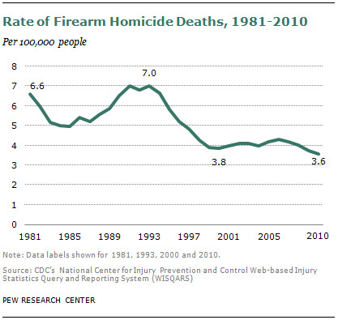
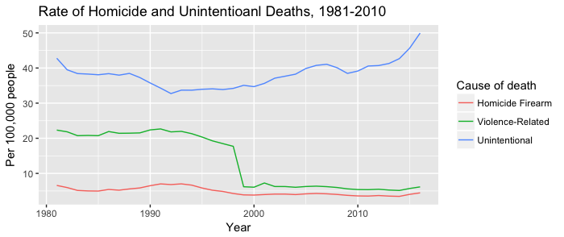
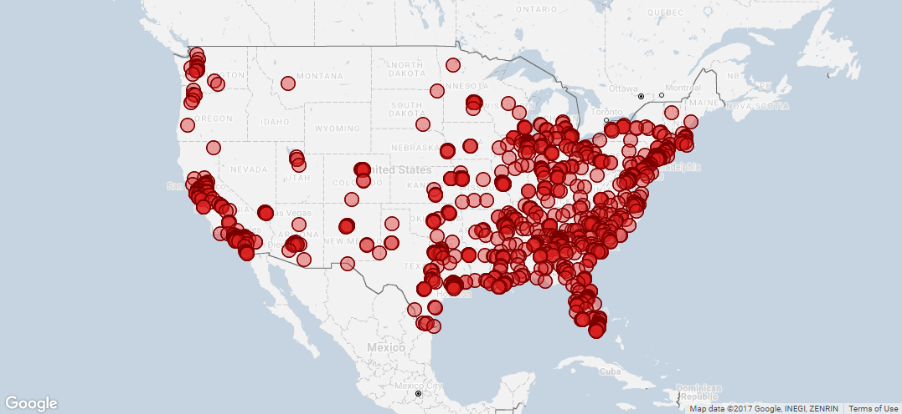
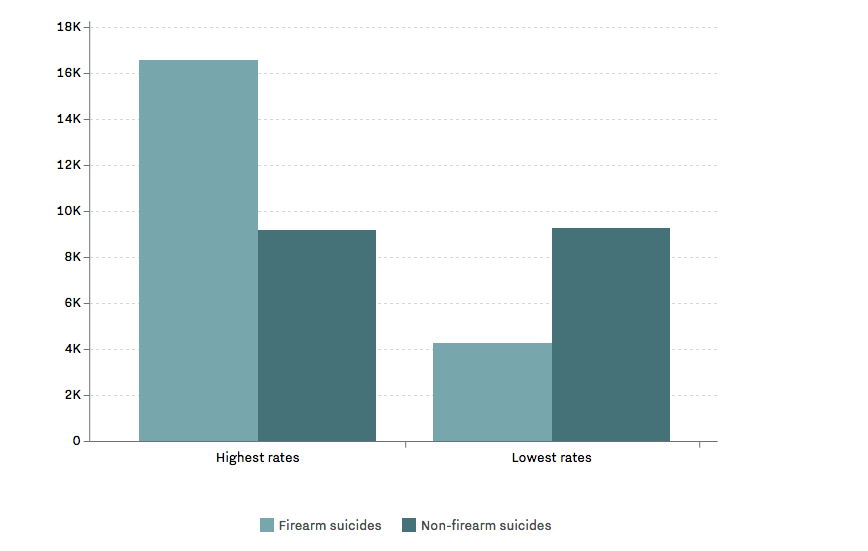
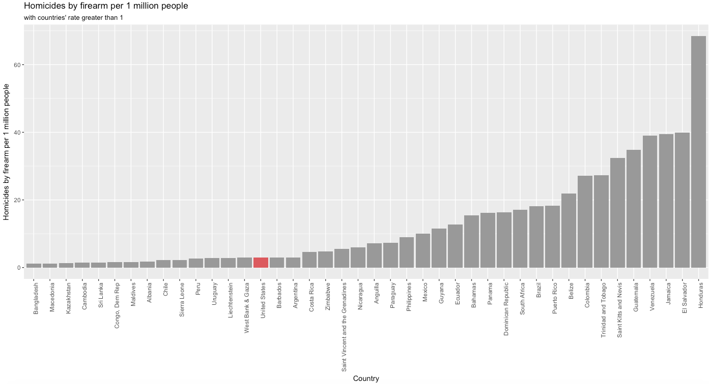
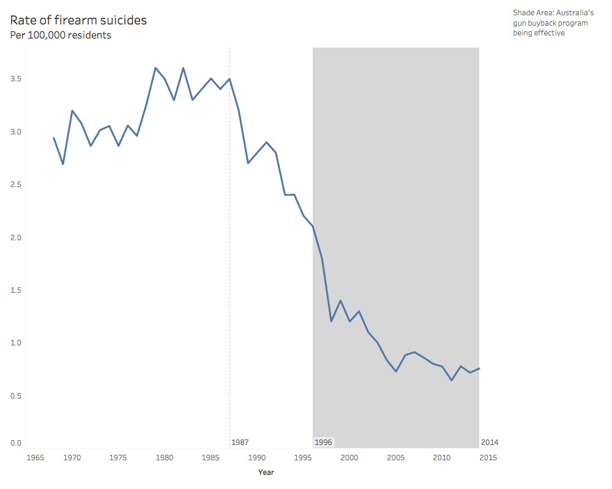

## Revised Data Product
## Tianmin Li
## Introduction
Gun issue has been a controversial issue in US for a long time. Vox created a data product that illustrate the severe status quo of gun issue in US with 17 maps and charts. However, many of the charts are not showing the whole picture and the corresponding conclusions are misleading. This project is trying to create a deceptive data product that will use same or similar data but draw different conclusions from the Vox’s data product. ?????????????????????????????
## Redesign Data Product
## Finding 1: Revision of "Rate of Firearm Homicide Deaths, 1981-2010"
The original graph demonstrates the rate of firearm deaths from 1981 to 2010. 



The following graph is a revision that shows the breakdown of homicide firearm, violence-related (homicide and suicide) and unintentional death rate from 1981 to 2010. 



### Development Process
Data source: Centers for Disease Control and Prevention

Fatal Injury Reports, 1981 to 1998 (ICD-9), National, Regional and State

Fatal Injury Reports, 1999 to 2016 (ICD-10), National and Regional 

Retrieved from https://webappa.cdc.gov/sasweb/ncipc/mortrate.html

Data cleaning: R

Data visualization: R (ggplot)

### Data Wrangling Steps
Read Data
```{r}
firearm_81_98 <- read.csv('firearm1981_1998.csv', header = TRUE) 
firearm_99_16 <- read.csv('firearm1999_2016.csv', header = TRUE)
homicide_81_98 <- read.csv('homicide1981_1998.csv', header = TRUE) 
homicide_99_16 <- read.csv('homicide1999_2016.csv', header = TRUE)
unintentional_81_98 <- read.csv('unintentional1981_1998.csv', header = TRUE) 
unintentional_99_16 <- read.csv('unintentional1999_2016.csv', header = TRUE)
```
Clean and Merge Two Datasets
```{r}
firearm <- rbind(firearm_81_98, firearm_99_16)
firearm <- firearm[,c("Year", "Cause.of.Death", "Crude.Rate")]
homicide <- rbind(homicide_81_98, homicide_99_16)
homicide <- homicide[,c("Year", "Cause.of.Death", "Crude.Rate")]
unintentional <- rbind(unintentional_81_98, unintentional_99_16)
unintentional <- unintentional[,c("Year", "Cause.of.Death", "Crude.Rate")]
fatal_rate <- rbind(firearm, homicide, unintentional)
fatal_rate <- fatal_rate[!is.na(fatal_rate$Year),]
fatal_rate$Cause.of.Death[fatal_rate$Cause.of.Death == "Homicide/Legal Intervention Injury"] <- "Violence-Related"
fatal_rate$Cause.of.Death[fatal_rate$Cause.of.Death == "Unintentional Injury"] <- "Unintentional"
fatal_rate <- subset(fatal_rate, Year < 2011)
```
Plot Data Using ggplot
```{r}
library(ggplot2)
ggplot(data=fatal_rate, aes(x=Year, y=Crude.Rate, group = Cause.of.Death, colour = as.factor(Cause.of.Death))) + geom_line() + theme(panel.grid.major = element_blank(), panel.grid.minor = element_blank(),
panel.background = element_blank(), axis.line = element_line(colour = "black")) + labs(title = 'Rate of Homicide and Unintentional Deaths, 1981-2010', y = 'Per 100,000 people', colour= 'Cause of death')
```
### Reasoning
The original graph is misleading with the stand-alone line of firearm homicide deaths. It was hard to draw conclusions about reasons behind the rate without comparing it to other death rates. In the revised version, the rate of firearm homicide deaths is compared with violent-related deaths (including all homicide and suicide) and unintentional deaths. From the revised graph we can tell that it is not just the firearm deaths that's dropping but also the overall voilent-related deaths over years. This point is confirmed by Ehrenfreund (2015) that the drop in gun violence is part of the drop in overall voilent crime. 


## Finding 2: Revision of Mass Shooting Map
The original graph shows the mass shooting since 2013. 



The following graph is a revision that shows mass shooting happening after 2013, together with states population.
(Interactive Graph: https://public.tableau.com/profile/tianmin.li#!/vizhome/MassShootingData_0/massshooting) 


### Development Process
Data source: Gun Violence Archive

Mass Shootings in 2014

Mass Shootings in 2015

Mass Shootings in 2016

Mass Shootings in 2017

Mass Shootings in 2018

Retrieved from http://www.gunviolencearchive.org/reports

U.S. Census Bureau

Annual Estimates fo the Resident Population for the United States, Regions, States, and Puerto Rico: April 1, 2010 to July 1, 2017 

Retrieved from https://www.census.gov/data/tables/2017/demo/popest/state-total.html

Data cleaning: R

Data visualization: Tableau

### Data Wrangling Steps
Read Data
```{r}
shoot_2014 <- read.csv("shoot_2014.csv", header = TRUE)
shoot_2015 <- read.csv("shoot_2015.csv", header = TRUE)
shoot_2016 <- read.csv("shoot_2016.csv", header = TRUE)
shoot_2017 <- read.csv("shoot_2017.csv", header = TRUE)
shoot_2018 <- read.csv("shoot_2018.csv", header = TRUE)
mass_shoot <- rbind(shoot_2014, shoot_2015, shoot_2016, shoot_2017, shoot_2018)
population <- read.csv("PEP_2017_PEPANNRES_with_ann.csv")
population <- population[, c("GEO.display.label", "respop72017")]
population <- population[-c(1), ]
population$GEO.display.label <- as.character(population$GEO.display.label)
library(tidyr)
population <- separate(population,GEO.display.label,into=c("County", "State" ),sep = ", ")
colnames(population)[3] <- "Population"
```
Export data to csv for visualization in Tableau
```{r}
write.csv(mass_shoot, file = "mass_shoot.csv")
write.csv(population, file = "population_2017.csv")
```
### Reasoning
The original graph is misleading because it is sending a message that in certain states such as California, it is more likely to have mass shooting. Looking at the places that have more mass shooting, it is actually very related to the population. In the revised graph, the population of the states and mass shooting are both displayed and there is a clear relationship between the two. 

### Detour
1. Reading the BRFSS 2001 data into R is challenging as it had the SAS Transport format. 
2. Combining two layers in one map in Tableau was challenging. Problem solved using dual axis maps. 

## Finding 3: Revision of "States with the Most Guns Report the Most Suicides"
The original graph shows the suicides in states with the highest and lowest rates of gun ownership.



The revised graph shows the relationship bewteen gun ownership and gun suicide deaths with all states data displayed.  
(Interactive Graph: https://public.tableau.com/profile/tianmin.li#!/vizhome/gun_suicide/Dashboard1)


### Development Process
Data source: Centers for Disease Control and Prevention

2001 BRFSS Data

Retrieved from https://www.cdc.gov/brfss/annual_data/annual_2001.htm

Centers for Disease Control and Prevention

Fatal Injury Reports, 1999 to 2016 (ICD-9), National, Regional and State (Restricted)

Retrieved from https://webappa.cdc.gov/sasweb/ncipc/mortrate.html

Data cleaning: R

Data visualization: Tableau

### Data Wrangling Steps
Read and Clean Data
```{r}
suicide <- read.csv("firearm.csv")
suicide <- suicide[,c("State", "Crude.Rate")]
library(Hmisc)
gun_ownership <- sasxport.get("CDBRFS01.XPT")
gun <- gun_ownership[,c("x.state", "firearm3")]
colnames(gun) <- c("st", "Firearm")
state_code <- read.csv("us-state-ansi-fips.csv")
gun <- merge(x = gun, y = state_code, by = "st", all.x = TRUE)
names(gun)[3] <- "State"
gun <- subset(gun, st!= 66 & st!= 72 & st!= 78)
```
According to the 2001 BRFSS Codebook, 1 represents firarm kept in or around home. This step will calculate the gun ownership rate per state. 
```{r}
library(dplyr)
gun_summary <- gun %>%
  group_by(State, stusps) %>%
  summarize( ownership = sum(Firearm ==1) / n())
```
Merge gun ownership with suicide data
```{r}
gun_combined <- merge(x = gun_summary, y = suicide, by = "State", all= TRUE)
```
Export Data for Visualization in Tableau
```{r}
write.csv(gun_combined, file = "gun_combined.csv")
```
### Reasoning
The original plot is not straight forward in terms of readiness. It is really hard to understand what the bars are showing and how to compare the four bars. Further, showing the highest/lowest gun ownership states are not convincing as these states can just be outliers. To tackle these two problems, all states' gun ownership vs. gun suicide rate are displayed in the revised plot.  

### Detour
1. Had to read the codebook to figure out variables to be used and the meaning of the variables.
2. Merging data from different sources are diffcult as some dataset is using state abbreviation and some using full names. A data set that translate both information is used to help merge data. 

## Deception Data Product 
## Finding 1: America doesn't have a severe firearm homicide problem compared to other countries such as Brazil.
### Vox's Version

Source: Vox, America's unique gun violence problem, explained in 17 maps and charts
### Deceptive Version

### Data Source
UNODC & Small arms survey, Retrieved from https://www.theguardian.com/news/datablog/2012/jul/22/gun-homicides-ownership-world-list#data. 
### Data Wrangling Steps
```{r}
# Read File
world_firearm <- read.csv("World_firearms_murders_and_ownership.csv")
# Select countries with Homicide by Firearm Rate per 100,000 Population greater than 1
selected_firearm <- subset(world_firearm, Homicide.by.firearm.rate.per.100.000.pop >1)
# Draw Bar Chart
library(ggplot2)
firearm <- ggplot(selected_firearm, aes(x=reorder(Country.Territory, Homicide.by.firearm.rate.per.100.000.pop), y=Homicide.by.firearm.rate.per.100.000.pop, fill=reorder(Country.Territory, Homicide.by.firearm.rate.per.100.000.pop)))
firearm + geom_bar(stat = "identity") + scale_fill_manual(values=c("#999999","#999999","#999999","#999999","#999999","#999999","#999999","#999999","#999999","#999999","#999999","#999999","#999999","#999999","#CC6666","#999999","#999999","#999999","#999999","#999999","#999999","#999999","#999999","#999999","#999999","#999999","#999999","#999999","#999999","#999999","#999999","#999999","#999999","#999999","#999999","#999999","#999999","#999999","#999999","#999999","#999999","#999999"), guide=FALSE) +theme(panel.grid.major = element_blank(), panel.grid.minor = element_blank(),panel.background = element_blank(), axis.line = element_line(colour = "black")) + labs(x = "Country", y = "Homicides by firearm per 1 million people", title = "Homicides by firearm per 1 million people", subtitle = "with countries' rate greater than 1")+ coord_flip()

```
### Summary
The Vox's graph is cherry picking countries so as to make the point that US is having a severe firearm homicide issue. Using the same dataset with more countries, it is noticed that US is actually on the lower end of firearm homicide rate. Note that we are only showing countries whose homicide by firearm rate are greater than 1. The biggest reason is to increase chart's readability. Further, the condition will not affect the conclusion as US is having the rate around 2, where the conclusion is trying to prove that US does not have a severe firearm homicide rate compared to other countries. 

## Finding 2: Rate of firearm suicides decrease, even before Australia's gun buyback program
### Vox's Version

Source: Vox, America's unique gun violence problem, explained in 17 maps and charts
### Deceptive Version

(Interactive Graph: https://public.tableau.com/profile/tianmin.li#!/vizhome/australia_3/Dashboard1)
### Data Source
Australian Bureau of Statistics. Causes of Death. Retrieved from http://www.abs.gov.au/ausstats/abs@.nsf/ViewContent?readform&view=productsbytopic&Action=Expand&Num=5.7.14. 
### Data Wrangling Steps
```{r}
#read Data
australia <- read.csv("Australia-Homicides-Suicides.csv")
#rename and clean variables
colnames(australia)[1] <- "Year"
colnames(australia)[2] <- "firearm_suicide"
colnames(australia)[5] <- "non_firearm_suicide"
australia <- australia[, c("Year", "firearm_suicide", "non_firearm_suicide")]
#include years greater than 1967
australia <- subset(australia, Year > 1967)
#export data for Tableau visualization
write.csv(australia, file = "australia.csv")
```
### Summary
Vox's chart is claiming that the decrease of Australia's firearm suicides is because of the gun buyback program. While the research that the article is referencing does show that the program is having a significant impact on decreasing firearm suicide, the conclusion is not reflected on the graph. The deceptive data product is adding a reference line to the original graph, and that shows that starting from 1987, Australia has been experiencing a drastic decline in firearm suicide, almost ten years before the program started. 
## Finding 3: Gun homicides have declined over the past couple decades, however, it could have little relationship with gun control policy but much related to abortion legalization.
### Vox's Version

Source: Vox, America's unique gun violence problem, explained in 17 maps and charts
### Deceptive Version

(Interactive Graph: https://public.tableau.com/profile/tianmin.li#!/vizhome/FirearmHomicideDeathsvs_AbortionRate/Dashboard1) 
### Data Source
1. Centers for Disease Control and Prevention. Fatal Injury Reports, National, Regional and State, 1981 – 2016. Retrieved from https://webappa.cdc.gov/sasweb/ncipc/mortrate.html. 
2. Centers for Disease Control and Prevention. Abortion Surveillance Reports. Retrieved from https://www.cdc.gov/mmwr/preview/mmwrhtml/ss5713a1.htm. 
### Data Wrangling Steps
```{r}
# Read and Merge Data
firearm_81 <- read.csv("firearm1981_1998.csv")
firearm_99 <- read.csv("firearm1999_2016.csv")
firearm <- rbind(firearm_81, firearm_99)
firearm <- firearm[, c("Year", "Crude.Rate")]
abortion <- read.csv("abortion.csv")
#adjust year in abortion data to show the effect of abortion by adding 20 years
abortion["Year"] <- abortion["Year"] +20
#merge firearm data with abortion data
firearm_abortion <- merge(firearm, abortion, by = "Year")
#export csv file for Tableau visualization
write.csv(firearm_abortion, file = "firearm_abortion.csv")
```
### Summary
The original graph is showing the decreasing rate of firearm homicide deaths, with a guess that some policies might impact the decrease or the deterrence of gun. The deceptive version is comparing the firearm homicide deaths to corresponding abortion rate. This is based on Levitt’s (2005) theory that the drop of crime rate is the result of legalized abortion case Roe vs. Wade in 1973. It is argued that abortion helped teenager mothers, who are very likely to give birth to criminals because of their unstable economic and social situation, to stop pregnancy, and thus less criminals are produced. In the deceptive data product, the abortion year has been adjusted by adding 20 years to show when “criminals” are grown-ups. It is clear that as the abortion rate goes up, the firearm suicide rate is going down and it is very consistent over time. To make the argument more compelling, the period of Federal Assault Weapons Ban is also shaded in the chart, which shows that the policy doesn’t really help explain the decrease and increase of firearm suicide. 
## Reference
Ehrenfreund M. (2015). We've Had a Massive Decline in Gun Violence in the United States. Here's Why. Retrieved from https://www.washingtonpost.com/news/wonk/wp/2015/12/03/weve-had-a-massive-decline-in-gun-violence-in-the-united-states-heres-why/?utm_term=.189af8a0f2cd. 
1. Levitt, S. D., & Dubner, S. J. (2005). Freakonomics: A rogue economist explores the hidden side of everything. New York: William Morrow.
2. Lopez G. (2017). America's unique gun violence problem, explained in 17 maps and charts. Retrieved from https://www.vox.com/policy-and-politics/2017/10/2/16399418/us-gun-violence-statistics-maps-charts. 
